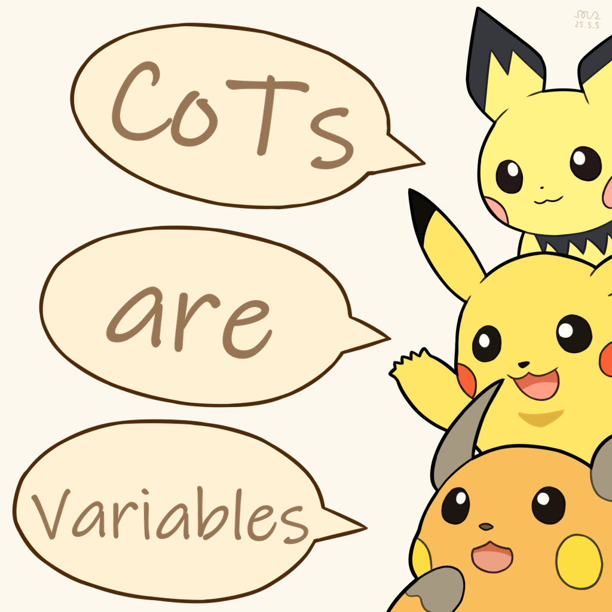

# Chain-of-Thought Tokens are Computer Program Variables

<div style="text-align: center">
    
    <p style="margin-top: 8px">Banner by @solitaryzero</p>
</div>

This is the repository for paper [Chain-of-Thought Tokens are Computer Program Variables](https://arxiv.org/abs/2505.04955) with code and scripts.

## Setup
Before running the code, you should install the dependencies by:

```shell
pip install -e requirements.txt
```

We use Qwen-2.5-1.5B for our experiments.
You can download the model by executing:
```shell
python ./src/preprocess/download_model.py
```
which will download the Qwen-2.5-1.5B model and save it to `./models/Qwen-2.5-1.5B`.

You can also manually download the model and put it under `./models`.

## Training & Evaluation
The scripts for experiments in the paper are stored in `./scripts`:

### 1. Preparation
Execute `sh ./scripts/{task}/dataset.sh` to generate synthetic datasets, where `{task}` belongs to `{multiplication, dynaprog, full_dynaprog}`

**Notice:** Steps 2-4 will take a long time.
You may instead execute the corresponding scripts in `./scripts/multiplication` and `./scripts/dynaprog` for 4\*4 multiplication and 5\*5 DP results, which we will use for subsequent experiments.

### 2. Section 3.1
Execute 
```shell
sh ./scripts/full_multiplication/run_plain.sh
sh ./scripts/full_multiplication/run_full_cot.sh
```
for multiplication task results, and execute 
```shell
sh ./scripts/full_dynaprog/run_plain.sh
sh ./scripts/full_dynaprog/run_full_cot.sh
```
for DP task results.

### 3. Section 3.2
Execute
```shell
sh ./scripts/full_multiplication/run_compressed_cot.sh
```
for multiplication task results.

### 4. Section 3.3
Execute
```shell
sh ./scripts/full_multiplication/run_latent.sh
sh ./scripts/full_dynaprog/run_latent.sh
```
for multiplication and DP task results.

### 5. Draw figures for Section 3 (Optional)
After executing steps 2-4, you may run 
```shell
sh ./scripts/full_multiplication/draw_results.sh
sh ./scripts/full_dynaprog/draw_results.sh
``` 
to obtain accuracy heatmaps.

The figures will be generated in `./results/full_multiplication/accuracy` and `./results/full_dynaprog/accuracy`.

### 6. Section 4.1
You should obtain 4\*4 multiplication and 5\*5 DP results first.
Then, execute
```shell
sh ./scripts/{task}/intervened_dataset.sh
sh ./scripts/{task}/run_intervention.sh
```
to perform intervention experiments, where `{task}` belongs to `{multiplication, dynaprog}`

Run `sh ./scripts/misc/draw_intervention.sh` to generate intervention success rate figures.

Run `sh ./scripts/multiplication/error_analysis.sh` to generate error breakdown figures.

The figures will be generated as `./results/misc/intervene_accuracy.pdf` and `./results/multiplication/error/error_breakdown.pdf`.

### 7. Section 4.2
You should obtain 5\*5 DP results first.
Then, execute
```shell
sh ./scripts/dynaprog/probe_dataset.sh
sh ./scripts/dynaprog/probe.sh
sh ./scripts/dynaprog/draw_probe.sh
sh ./scripts/dynaprog/probe_breakdown.sh
```
for probing results.

The figures will be generated in `./results/dynaprog/probe_figure` and `./results/dynaprog/probe_breakdown`.

## How to Run Experiments with Custom Models
You may use your custom model with two steps:
1. Put the model under `./models`;
2. Change the `--base_model` parameter in different scripts to the new model path.